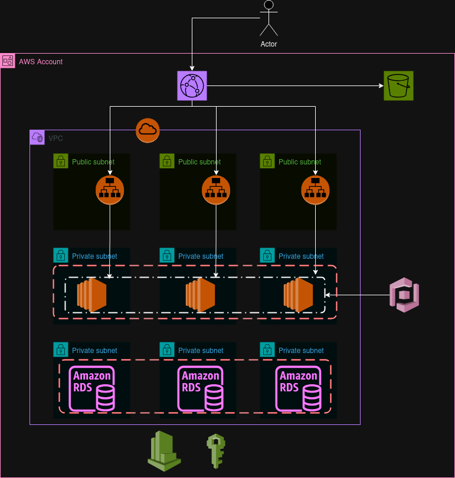

# Projeto Terraform ADA



Este projeto utiliza Terraform para provisionar e gerenciar a infraestrutura na AWS para o projeto ADA.

## Descrição

O projeto Terraform ADA tem como objetivo automatizar a criação e o gerenciamento da infraestrutura necessária para suportar o projeto ADA na AWS. Utilizando a infraestrutura como código (IaC) com o Terraform, garantimos que todos os recursos sejam provisionados de maneira consistente e repetível, reduzindo erros manuais e aumentando a eficiência operacional.

### Benefícios do Uso do Terraform

- **Automação**: Reduz a necessidade de intervenção manual na criação e configuração de recursos.
- **Consistência**: Garante que a infraestrutura seja provisionada da mesma forma em diferentes ambientes.
- **Versionamento**: Permite versionar a infraestrutura, facilitando o controle de mudanças e auditorias.
- **Escalabilidade**: Facilita a escalabilidade da infraestrutura conforme a demanda do projeto cresce.
- **Reutilização**: Módulos reutilizáveis permitem a padronização e reutilização de configurações em diferentes projetos.

### Objetivos do Projeto

- Provisionar uma infraestrutura segura e escalável na AWS.
- Facilitar o gerenciamento e a manutenção da infraestrutura.
- Garantir a alta disponibilidade e resiliência dos serviços.
- Automatizar processos de deploy e configuração de recursos.
- Fornecer uma base sólida para o desenvolvimento e a operação contínua do projeto ADA.

### Tecnologias Utilizadas

- **Terraform**: Ferramenta de IaC para definir e provisionar a infraestrutura.
- **AWS**: Provedor de nuvem utilizado para hospedar os recursos.
- **Git**: Sistema de controle de versão para gerenciar o código do projeto.
- **CloudFront**: Serviço de CDN para distribuição de conteúdo.
- **S3**: Serviço de armazenamento de objetos.
- **EC2**: Serviço de computação para execução de instâncias virtuais.
- **RDS**: Serviço de banco de dados relacional gerenciado.
- **IAM**: Serviço de gerenciamento de identidades e acessos.

Com essa abordagem, o projeto Terraform ADA busca proporcionar uma infraestrutura robusta e eficiente, alinhada com as melhores práticas de DevOps e engenharia de software.

## Estrutura do Projeto

- `main.tf`: Configuração principal do Terraform, incluindo o backend S3 para armazenar o estado.
- `variables.tf`: Definição das variáveis utilizadas no projeto.
- `provider.tf`: Configuração do provedor AWS.
- `s3.tf`: Configuração do bucket S3 para armazenar o estado do Terraform.
- `cloudfront.tf`: Configuração do CloudFront para distribuição de conteúdo.
- `output.tf`: Definição das saídas do Terraform.

## Recursos Provisionados

- **VPC**: Rede virtual para o projeto ADA.
- **Subnets**: Sub-redes dentro da VPC.
- **NAT Gateway**: Gateway NAT para permitir acesso à internet para instâncias privadas.
- **CloudFront**: Distribuição de conteúdo com suporte a HTTP e HTTPS.
- **S3 Bucket**: Armazenamento de objetos e estado do Terraform.
- **EC2 Instances**: Instâncias de computação para rodar aplicações.
- **RDS**: Banco de dados relacional gerenciado.
- **IAM Roles**: Perfis de acesso para os recursos AWS.

## Tags

Todos os recursos são tagueados com as seguintes tags:

- **Projeto**: ada
- **Dono**: Flavio

## Pré-requisitos

- Conta AWS com permissões adequadas.
- [Terraform](https://learn.hashicorp.com/tutorials/terraform/install-cli) instalado.
- Configuração das credenciais AWS.

## Como Usar

1. Clone o repositório:
    ```sh
    git clone https://github.com/seu-usuario/projeto-terraform-ada.git
    cd projeto-terraform-ada
    ```
2. Instale o Terraform: [Instruções de instalação](https://learn.hashicorp.com/tutorials/terraform/install-cli).
3. Configure suas credenciais AWS.
4. Inicialize o Terraform:
    ```sh
    terraform init
    ```
5. Visualize o plano de execução:
    ```sh
    terraform plan
    ```
6. Aplique as configurações:
    ```sh
    terraform apply
    ```

## Estrutura de Diretórios

- `modules/`: Módulos reutilizáveis do Terraform.
- `environments/`: Configurações específicas para diferentes ambientes (desenvolvimento, produção, etc.).
- `scripts/`: Scripts auxiliares para automação de tarefas.

## Licença

Este projeto está licenciado sob a [Mozilla Public License 2.0](https://www.mozilla.org/en-US/MPL/2.0/).
